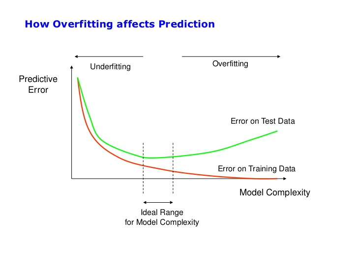
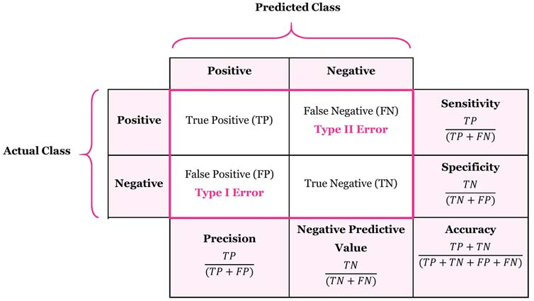

# Overview of Learning Paradigms

```{r}
#| include: false
suppressPackageStartupMessages(library(tidyverse))
```

Before studying any single algorithm, it helps to have a map of the territory. Machine learning is a large field, and the methods it contains can look bewildering when met one at a time. Yet, almost every method answers one of just a few basic questions: Do we have labeled examples to learn from? Are we trying to predict something specific, or just to find structure? Do we learn once from a fixed dataset, or do we learn by acting and seeing what happens? Sorting methods by these questions turns a long list of techniques into a small number of families.

This chapter gives that map. It sketches how the classical paradigms, supervised, unsupervised, and reinforcement learning, differ in what data they assume, what goal they pursue, and what techniques they bring to bear, and it points to the many further paradigms (semi-supervised, self-supervised, active, weakly-supervised, few-shot and zero-shot, meta-learning, transfer and multi-task, online, federated, ensemble, continual, curriculum, imitation and inverse reinforcement, transductive, adversarial, and metric learning) that get their own treatment later in the book. The aim is intuition and vocabulary, not depth: the detailed chapters elsewhere in the book are where each method gets its full treatment. Reading this overview first means that when you later meet, say, random forests or k-means, you already know which family they belong to and what problem they were built to solve.

We spend the most time on supervised learning, because it is the most common setting in practice and because the ideas it introduces (training versus test data, overfitting, cross-validation, performance measures) reappear everywhere else. We then turn to unsupervised learning, where the data carry no labels and the goal shifts to discovering groups, densities, or low-dimensional structure. The chapter closes with brief looks at semi-supervised learning, which mixes labeled and unlabeled data, and reinforcement learning, which learns from interaction over time.

> **Key idea:** The paradigm is decided by the data and the goal, not by the algorithm. Ask "what am I given, and what am I trying to produce?" first; the choice of method follows.

## A Visual Map of the Field

It helps to see the territory before walking through it. The diagrams below are the same map the book follows: first how the major types of learning relate, then how the methods inside each type connect and build on one another. Skim them now for orientation, and return to them whenever a new chapter feels disconnected from what came before.

Figure @fig-overview-map-types shows the top level. Supervised and unsupervised learning are split by whether labels are available; reinforcement learning is set apart by learning from interaction rather than a fixed dataset; deep learning is a modeling technology that cuts across all of them; and the learning paradigms describe how the training signal is obtained.

```{r fig-overview-map-types, echo=FALSE, fig.cap="How the major types of learning relate. Deep learning and the learning paradigms cut across the supervised and unsupervised distinction."}
DiagrammeR::mermaid('
graph TD
  ML["Machine Learning"]
  ML --> SUP["Supervised Learning"]
  ML --> UNS["Unsupervised Learning"]
  ML --> RL["Reinforcement Learning"]
  SUP --> DL["Deep Learning"]
  UNS --> DL
  SUP --> PAR["Learning Paradigms"]
  UNS --> PAR
  DL --> PAR
  RL --> PAR
')
```

Within supervised learning, the methods form a few lineages, shown in Figure @fig-overview-map-supervised: smoothers that bend a global curve, instance- and margin-based classifiers, and the tree lineage that grows from a single tree into the most powerful ensembles in the book.

```{r fig-overview-map-supervised, echo=FALSE, fig.cap="The supervised-learning methods and how they relate. The tree lineage grows from a single tree into bagging, random forests, and boosting."}
DiagrammeR::mermaid('
graph TD
  S["Supervised Learning"]
  S --> LIN["Linear and Penalized Regression"]
  S --> SMO["Smoothers: splines, GAM, kernel, local"]
  S --> GP["Gaussian Processes"]
  S --> KNN["k-Nearest Neighbors"]
  S --> NB["Naive Bayes"]
  S --> SVM["Support Vector Machines"]
  S --> DA["Discriminant Analysis"]
  S --> NN["Neural Networks"]
  S --> TREE["Decision Trees"]
  TREE --> BAG["Bagging"]
  BAG --> RF["Random Forests"]
  TREE --> BOOST["Boosting"]
  BOOST --> GBM["Gradient Boosting: XGBoost, LightGBM"]
  TREE --> BART["Bayesian Additive Regression Trees"]
')
```

Unsupervised learning divides by goal, as Figure @fig-overview-map-unsupervised shows: grouping points, compressing them into fewer dimensions, or estimating the density they came from.

```{r fig-overview-map-unsupervised, echo=FALSE, fig.cap="Unsupervised-learning methods, organized by goal: clustering, dimension reduction, and density estimation."}
DiagrammeR::mermaid('
graph TD
  U["Unsupervised Learning"]
  U --> CL["Clustering"]
  U --> DR["Dimension Reduction"]
  U --> DE["Density Estimation"]
  U --> IM["Interpretable ML"]
  DR --> PCA["PCA and linear projections"]
  DR --> MAN["MDS, t-SNE, UMAP"]
')
```

Deep learning is best read as an evolution, traced in Figure @fig-overview-map-deep: from the multilayer perceptron to convolutional and recurrent networks, then to attention and the Transformer, which underpins BERT and modern large language models, with autoencoders, generative models, and graph networks as parallel branches.

```{r fig-overview-map-deep, echo=FALSE, fig.cap="The deep-learning lineage, from the multilayer perceptron through attention and Transformers to large language models, with generative and graph branches."}
DiagrammeR::mermaid('
graph LR
  MLP["Multilayer Perceptron"] --> CNN["CNN for images"]
  MLP --> RNN["RNN and LSTM for sequences"]
  CNN --> ATT["Attention"]
  RNN --> ATT
  ATT --> TR["Transformers"]
  TR --> BERT["BERT"]
  TR --> LLM["LLMs and Foundation Models"]
  TR --> MOE["Mixture of Experts"]
  MLP --> AE["Autoencoders"]
  AE --> GEN["Generative: VAE, GAN, Diffusion"]
  MLP --> GNN["Graph Neural Networks"]
')
```

Reinforcement learning has its own progression, shown in Figure @fig-overview-map-rl: from the Markov decision process through dynamic programming and model-free methods to deep reinforcement learning, with bandits, model-based, offline, and multi-agent settings as branches.

```{r fig-overview-map-rl, echo=FALSE, fig.cap="Reinforcement-learning methods, from the Markov decision process to deep RL, with bandit, model-based, offline, and multi-agent branches."}
DiagrammeR::mermaid('
graph TD
  RL["Reinforcement Learning"]
  RL --> BAND["Multi-Armed and Contextual Bandits"]
  RL --> MDP["Markov Decision Processes"]
  MDP --> DP["Dynamic Programming"]
  MDP --> MF["Model-Free Methods"]
  MF --> MCTD["Monte Carlo and Temporal-Difference"]
  MCTD --> QL["Q-learning and SARSA"]
  MF --> PG["Policy Gradient"]
  PG --> AC["Actor-Critic"]
  QL --> DRL["Deep Reinforcement Learning"]
  AC --> DRL
  MDP --> MB["Model-Based RL"]
  RL --> OFF["Offline RL"]
  RL --> MARL["Multi-Agent RL"]
')
```

Finally, the learning paradigms group into four families by the problem they solve, as Figure @fig-overview-map-paradigms shows: where the labels come from, how to learn from few examples, how and where learning happens over time, and how the objective is structured.

```{r fig-overview-map-paradigms, echo=FALSE, fig.cap="The learning paradigms, grouped into four families by the problem they address."}
DiagrammeR::mermaid('
graph TD
  P["Learning Paradigms"]
  P --> DA["Data Availability"]
  P --> SE["Sample Efficiency"]
  P --> OP["Operational and Streamed"]
  P --> AG["Architecture and Goal-Driven"]
  DA --> DA1["Semi-, self-, weakly-supervised, active"]
  SE --> SE1["Few/zero-shot, meta, transfer"]
  OP --> OP1["Online, federated, ensemble, continual"]
  AG --> AG1["Curriculum, imitation, transductive, adversarial, metric"]
')
```

## Prediction versus Estimation

This book leans toward prediction, so it is worth being precise early about how prediction differs from the estimation and inference goals that dominate classical statistics and the companion volume on causal inference. The distinction is not about which algorithm you run; it is about which quantity you actually care about.

Take the familiar linear model

$$
Y = \beta X + \epsilon .
$$

Two very different questions can be asked of it. In an estimation problem the quantity of interest is the coefficient $\beta$ itself. We want $\hat\beta$ together with an honest standard error, because $\beta$ answers a scientific question: how does $Y$ respond when $X$ changes, holding other things fixed? In a prediction problem the quantity of interest is instead the fitted value $\hat Y$ for a new case. There we do not much care what the coefficients are, only that the predictions are accurate on data the model has never seen.

The two goals are judged by different yardsticks, summarized in Table @tbl-overview-pred-est.

| Aspect | Prediction | Estimation and inference |
|------------------------|------------------------|------------------------|
| Target | $\hat Y$ for a new case | $\hat\beta$ and its uncertainty |
| Yardstick | out-of-sample loss | unbiasedness, consistency, valid intervals |
| Preferred model | whatever generalizes best | interpretable, identified, well specified |
| Bias in coefficients | acceptable if it lowers error | to be avoided |

: Prediction and estimation answer different questions and are judged by different standards. {#tbl-overview-pred-est}

Why do the goals conflict? The short answer is the bias-variance tradeoff. Regularized and flexible methods deliberately bias the coefficients toward zero, or toward each other, to cut variance, which usually lowers out-of-sample error even though the individual coefficients are no longer unbiased. The deeper reason appears when predictors are correlated or numerous: many different coefficient vectors then produce almost the same predictions, so the data can pin down $\hat Y$ well while leaving $\beta$ poorly identified.

> **Intuition:** You can predict a sum accurately without knowing its parts. If two predictors move together, the model can tell what their combined effect on $Y$ is, and predict well, while being unsure how to split the credit between them.

A short simulation makes this concrete. We generate two highly correlated predictors whose true coefficients both equal one, fit ordinary least squares on many bootstrap resamples, and watch how the estimated coefficients move. Figure @fig-overview-pred-est-coef shows the result.

```{r fig-overview-pred-est-coef, fig.cap="Bootstrap ordinary-least-squares coefficients for two predictors with correlation 0.99 whose true coefficients are both one. The separate coefficients scatter widely along the line where their sum is two (dashed), yet that sum, which drives the prediction, stays stable. Prediction is easy here even though estimating the separate coefficients is not."}
set.seed(1)
n <- 200
Sigma <- matrix(c(1, 0.99, 0.99, 1), 2, 2)
X <- MASS::mvrnorm(n, mu = c(0, 0), Sigma = Sigma)
dat <- data.frame(y = X[, 1] + X[, 2] + rnorm(n), x1 = X[, 1], x2 = X[, 2])

boot <- replicate(1000, {
  i <- sample(n, replace = TRUE)
  coef(lm(y ~ x1 + x2, data = dat[i, ]))[c("x1", "x2")]
})

plot(boot[1, ], boot[2, ], pch = 19, col = "#3366aa55",
     xlab = expression(hat(beta)[1]), ylab = expression(hat(beta)[2]))
abline(2, -1, lty = 2)
```

The individual coefficients in Figure @fig-overview-pred-est-coef range over a wide interval, so any single fit could report a misleading effect size. Their sum, which is what the prediction depends on, barely moves. Table @tbl-overview-pred-est-sd quantifies this.

```{r tbl-overview-pred-est-sd}
summary_tab <- data.frame(
  Quantity = c("Coefficient on x1", "Coefficient on x2", "Their sum (drives prediction)"),
  `Bootstrap SD` = round(c(sd(boot[1, ]), sd(boot[2, ]), sd(boot[1, ] + boot[2, ])), 3),
  check.names = FALSE
)
knitr::kable(summary_tab, caption = "Bootstrap variability of the separate coefficients versus their sum. The separate coefficients are unstable; the sum, which the prediction relies on, is not.")
```

The lesson is the recurring theme of the book. When the goal is prediction, we choose and judge models by out-of-sample accuracy and accept biased or unstable coefficients as a fair price. When the goal is estimation, that same trade is unacceptable, and the methods and safeguards of the first volume apply instead.

## Supervised Learning

Supervised learning is the setting where, for each example, we already know the right answer. The data come in pairs: an input (a set of attributes describing an object) and an output (the label or value we want to predict). The task is to learn, from these pairs, a function $f$ of the inputs that best approximates the outputs, so that we can apply it to new objects whose outputs we do not yet know.

$$
\hat{Y} = f(X_1,..,X_n)
$$

Here $X_1, \dots, X_n$ are the input attributes and $\hat{Y}$ is the model's prediction of the output. The word "supervised" refers to the fact that the known outputs act like a teacher, telling the algorithm during training whether its guesses are right or wrong.

Supervised models serve two complementary purposes. The first is *predictive*: given a new object described by its attributes, produce a forecast of its output. The second is *informative*: help us understand the relationship between inputs and outputs, for example which attributes matter and in which direction they push the prediction. A spam filter leans on the predictive purpose; a study of which factors raise a patient's risk leans on the informative one. Many models serve both at once, though usually one purpose dominates.

### Splitting the data: training, validation, and test

A model that memorizes the data it was built on tells us nothing about how it will behave on data it has never seen, which is the only thing we actually care about. To guard against this, we partition the available data into three roles, each used for a different job.

-   Training set: used to fit the model, that is, to estimate its parameters.
-   Validation set: used to tune hyperparameters (settings the algorithm does not learn on its own, such as how deep a tree may grow).
-   Test set: used once, at the very end, to estimate how the final model will perform on genuinely new data. This estimate is called the *generalization error*.

> **Warning:** The test set is sacred. If you peek at it while choosing or tuning your model, its error estimate becomes optimistic and stops being an honest forecast of future performance. Touch it only once, after all decisions are made.

### What a learning algorithm actually is

It is easy to treat a learning algorithm as a black box, but three ingredients define every one of them. First, a *hypothesis space* $H$, the family of candidate models the algorithm is allowed to consider (for example, all straight lines, or all decision trees of a given size). Second, a *quality measure* that scores how good any particular model is. Third, an *optimization strategy* that searches the hypothesis space for a high-scoring model. Given a learning sample, the algorithm returns the function $h$ in $H$ of maximum quality.

> **Intuition:** Learning is search. The hypothesis space says what is on the menu, the quality measure says what "good" means, and the optimization strategy is how we hunt for the best item on the menu.

### Model selection and the problem of generalization

A tempting idea is to pick the model that makes the fewest mistakes on the very data it was trained on. The error measured this way is called the *re-substitution error*, and it is a trap. A flexible enough model can drive it to zero simply by memorizing the training examples, while performing terribly on anything new. What we truly want to minimize is the *generalization error*: how well the model predicts future data drawn from the same distribution.

Because we cannot observe future data, we estimate generalization error by holding some data back. The simplest version is evaluation on a single test set:

1.  Randomly choose a percentage (e.g., 30%) of the data to be in a test set.
2.  The remainder is the training set.
3.  Learn the model from the training set.
4.  Estimate its future performance on the test set.

The two failure modes this procedure is meant to expose are overfitting and underfitting. A model overfits when the learning algorithm starts fitting noise, capturing quirks of the training sample that will not recur. A model underfits when it is too simple to capture the real pattern, so it does poorly even on the training data. Good models sit between these extremes.

The single test-set approach has clear trade-offs. On the positive side it is very simple and computationally efficient. On the negative side it wastes data (the test portion never trains the model) and it is very unstable when the dataset is small, because a single unlucky split can swing the estimate.

Figure @fig-overview-overfitting shows visually how increasing model flexibility first reduces error, then increases it again as the model begins to chase noise.

```{r fig-overview-overfitting, fig.align='center', echo=FALSE, fig.cap="As model flexibility increases, training error keeps falling while test error first decreases and then rises again once the model starts fitting noise."}
library("jpeg")

```

### Cross-validation

To use data more efficiently than a single split allows, we turn to cross-validation, which reuses every observation for both training and testing across different rounds.

The most thorough form is leave-one-out cross validation (LOOCV). It works as follows:

-   For $k = 1$ to $N$:
    -   remove the $k$-th object from the learning sample,
    -   learn the model on the remaining objects,
    -   apply the model to get a prediction for the $k$-th object.
-   Report the proportion of mis-classified objects.

Its appeal is that it does not waste data: each model is trained on almost the full sample ($N-1$ points), so the estimate reflects nearly the method you would actually deploy. Its drawbacks are that it is computationally intensive (you train $N$ separate models) and that the estimate has high variance, since the $N$ training sets overlap heavily and the held-out predictions are highly correlated.

A practical middle ground is K-fold cross validation, which trades a little of LOOCV's thoroughness for far less computation. The data are randomly partitioned into $k$ subsets, or folds (often $k = 10$). Then:

-   For each fold:
    -   choose that fold as a temporary test set,
    -   train on the other $k-1$ folds, and compute performance on the held-out fold.
-   Report the average performance over the $k$ runs.

Each observation is held out exactly once, so every point contributes to the estimate without any single model seeing it during its own evaluation. When $k$ equals the number of objects, K-fold cross validation reduces to leave-one-out cross validation.

> **Tip:** A rough rule of thumb for choosing an evaluation strategy by sample size:
>
> -   Lots of data (more than 1000): a single held-out test set is fine.
> -   Small data (100 to 1000): use 10-fold cross-validation.
> -   Very small data (fewer than 100): use leave-one-out cross-validation.

Whatever strategy you use during development, reserve the testing set to estimate the performance of the *final* model, once all tuning is done.

### Performance measures

The error rate is not the only way to assess a predictive model, and it is often the wrong one. In a problem where 99% of emails are legitimate, a model that flags nothing as spam is 99% accurate and completely useless. To see past a single number, in binary classification we summarize results in a contingency table, also called a *confusion matrix*, which counts the four possible combinations of predicted and actual labels, as shown in Figure @fig-overview-confusion-matrix.

```{r overview-confusion-matrix, fig.align='center', echo=FALSE, fig.cap="The confusion matrix for binary classification, cross-tabulating predicted against actual labels into true positives, true negatives, false positives, and false negatives."}
library("jpeg")

```

From the four counts in that table (true positives $TP$, true negatives $TN$, false positives $FP$, and false negatives $FN$, with $P$ and $N$ the total actual positives and negatives) we can build several criteria, each emphasizing a different kind of mistake:

$$
\text{Error rate} = \frac{FP + FN}{N + P} \\
\text{Accuracy} = \frac{TP + TN}{N + P} = 1 - \text{Error rate} \\
\text{Sensitivity or recall} = \frac{TP}{P} \\
\text{Specificity} = \frac{TN}{TN + FP} \\
\text{Precision} = \frac{TP}{TP + FP} \\
$$

In words: accuracy is the share of all predictions that are correct; recall (sensitivity) is the share of actual positives that we caught; specificity is the share of actual negatives we correctly left alone; and precision is the share of our positive predictions that were right. Which of these matters most depends entirely on the cost of each kind of error in your application.[^003-overview-1]

[^003-overview-1]: For a cancer screen, a missed case (low recall) is far worse than a false alarm, so we tolerate low precision to push recall up. For a spam filter, deleting a real email (low precision) is worse than letting one spam through, so we favor precision.

Most classifiers do not output a hard label directly; they output a score, and we choose a *decision threshold* to convert that score into a positive or negative call. ROC curves and precision/recall curves trace what happens to the performance measures as we sweep this threshold across all its possible values. Each point on the curve corresponds to one threshold, and the curve as a whole, sometimes called a robustness check, shows the trade-offs available. In general you want a large area under the curve, since that indicates good performance across many threshold choices rather than just one lucky setting.

> **When to use this:** Reach for ROC and precision/recall curves whenever the classes are imbalanced or the costs of false positives and false negatives differ, which is to say, most real problems. A single accuracy number hides exactly the trade-off these curves reveal.

### Comparing learning models

When deciding among methods, accuracy is rarely the only consideration. Three criteria usually compete:

-   Accuracy: measured by the generalization error (estimated by cross-validation).
-   Efficiency: computing time and scalability for both learning and prediction.
-   Interpretability: how much the model helps us understand the input-output relationship.

These goals pull against each other, and the right balance depends on the application. A model that must run on a phone in milliseconds, or whose decisions must be explained to a regulator, may justly lose a little accuracy to gain speed or transparency. Expect to make a trade-off rather than to find one method that wins on all three.

### A catalog of supervised techniques

With the evaluation machinery in place, here is a high-level inventory of supervised methods, grouped by the kind of function they fit. You will meet each group in detail later; for now the goal is to recognize the landscape.

-   Linear classifiers (numerical functions), which separate classes with a (possibly transformed) linear boundary: the perceptron, logistic regression, support vector machines (SVMs, which extend from linear to nonlinear boundaries through feature transforms and kernel functions), Ada-line, and the multi-layer perceptron (MLP).
-   Parametric, probabilistic models, which assume a probability model for the data: naive Bayes, Gaussian discriminant analysis (GDA), hidden Markov models (HMM), and probabilistic graphical models.
-   Non-parametric, instance-based methods, which make predictions by referring back to nearby training examples: k-nearest neighbors, kernel regression, kernel density estimation, and local regression.
-   Non-metric, symbolic methods, which reason with rules rather than distances: classification and regression trees (CART) and decision trees.
-   Aggregation (ensemble) methods, which combine many models into one: bagging (bootstrap + aggregation), AdaBoost, and random forests.

For completeness, the unsupervised side splits into clustering (k-means, spectral clustering), density estimation (Gaussian mixture models, graphical models), and dimensionality reduction (principal component analysis, factor analysis); we return to these later in the chapter. Semi-supervised learning aims to exploit both labeled and unlabeled data to build better models than either alone, for instance through self-training (iteratively labeling some unlabeled examples with a model learned from the previously labeled ones) and active learning. Reinforcement learning is learning from interaction, where the goal is to choose a sequence of actions, called a *policy*, that maximizes the discounted reward $r_0 + \gamma r_1 + \gamma^2r_2 + ...$ with $0 \le \gamma <1$.

The next two subsections zoom in on two of the most important supervised techniques, decision trees and random forests, because they illustrate the move from a single interpretable model to a powerful ensemble.

### Decision Tree

A decision tree is a tree-structured plan: a sequence of tests on the input attributes that leads, step by step, to a prediction of the output. You can read one like a flowchart of yes/no questions. Given the attributes of a new object, you start at the top and follow the branch that matches each answer until you reach a leaf, which carries the prediction. The appeal is that the logic is fully visible: every prediction comes with the chain of questions that produced it.

To state the setup precisely, the inputs are described as follows. We have $d$ features (attributes) $x^{(1)},x^{(2)},...,x^{(d)}$, where each $x^{(j)}$ takes values in some domain $O_j$. That domain may be categorical (for example $O_j=(\text{red},\text{blue})$) or numerical (for example $H_j = (0,10)$). The output variable $Y$ has its own domain $O_Y$, and its type sets the task: a categorical $Y$ gives a classification problem, a numerical $Y$ a regression problem. The data $D$ consist of $n$ examples $(x_i, y_i)$, where each $x_i$ is a $d$-dimensional feature vector and $y_i \in O_Y$.

A decision tree works by splitting the data at each internal node and letting each leaf node make a prediction. Building one therefore comes down to three questions, which the following subsections address in turn: how to find the best split, when to stop splitting, and how to predict at a leaf.

#### Find best split

At each node we pick an attribute and a value that optimize some criterion measuring how much "purer" the resulting groups are. The criterion differs by task: for regression we improve *purity* (how tightly the target values cluster within a node), and for classification we use *information gain*, which measures how much knowing an attribute $X$ tells us about the class $Y$.

To make information gain precise we first need *entropy*, a measure of how uncertain or spread out a distribution is. The entropy of $X$ is

$$H(X) = -\sum_{j=1}^{m} p_j log p_j$$

Entropy is highest when outcomes are most unpredictable and lowest when they are nearly certain:

-   High entropy means $X$ is close to a uniform distribution: a histogram of its values would look flat, because every value is about equally likely.
-   Low entropy means $X$ is from a varied distribution: a histogram would have many lows and one or two highs, because a few values dominate.

*Information gain* is then the reduction in entropy about $Y$ that we get by knowing $X$:

$$IG(Y|X) = H(Y) - H(Y|X)$$

> **Intuition:** Imagine you must transmit the value of $Y$ over a wire. Information gain answers: how many bits, on average, would it save you if both ends of the line already knew $X$? An attribute with high information gain is one whose value resolves a lot of the uncertainty about the class, which is exactly what makes it a good split.

#### Stopping Criteria

Splitting forever would just rebuild the original data point by point, so we need rules for when to stop and declare a leaf. Common criteria include:

-   When the leaf is "pure," meaning the target variable does not vary much within it: $Var(Y) <$ threshold.
-   When the number of examples in the leaf is too small to split reliably.
-   An information-based criterion can also be used, stopping when further splits would yield little gain.

#### Find Prediction

Once a node becomes a leaf, it summarizes the examples that landed there into a single prediction. The summary depends on the task:

-   Regression: predict the average $y$ of the examples in the leaf.
-   Classification: predict the most common $y$ among the examples in the leaf.

### Random Forest

A single decision tree is fast and easy to read, but on its own it usually does not predict very well. Its problem is instability: split the data slightly differently and the tree can change a lot, which is another way of saying it has high *variance*. The question that motivates ensembles is natural: if one tree is shaky, what if we learn many trees and combine them?

> **Key idea:** Averaging many noisy-but-unbiased predictions cancels out their individual errors. The ensemble keeps the trees' low bias while shrinking their variance, which is why a forest beats a lone tree.

The starting point is bagging, short for bootstrap aggregating, a general recipe for turning a high-variance method into a low-variance one. The logic is this: if we had many independent realizations of the data, we could fit the model to each and average the results, and averaging many noisy estimates produces a less uncertain one. Concretely, if for each sample $b$ we compute $f^b(x)$, the bagged prediction is

$$\hat{f}_{avg} (x) = \frac{1}{B} \sum_{b=1}^{B} \hat{f}^b (x)$$

In practice we rarely have many independent datasets, so we manufacture them by *bootstrapping*: drawing samples with replacement from the one dataset we have. We construct $B$ (often hundreds of) trees, learn a classifier on each bootstrap sample, and average them. This is very effective and reduces overfitting (variance), can be applied with one type of classifier or several, and is easy to parallelize since the trees are built independently.

The gain in accuracy comes at a cost in interpretability. A single tree can be read directly, but an average of hundreds of trees cannot, so we lean on *variable importance measures* to recover some understanding of which inputs matter. Bagging improves prediction accuracy at the expense of interpretability.

To see why bagging helps but only up to a point, consider the variance arithmetic. The bagged trees are identically distributed, so averaging them does not change the bias: the bias of bagged trees is the same as that of an individual tree. Variance is where the benefit lives. An average of $B$ *independent* random variables, each with variance $\sigma^2$, has variance $\sigma^2/B$. But bootstrap-sampled trees are identically distributed yet *not* independent; with pairwise correlation $\rho$ the variance is

$$\rho \sigma^2 + \frac{1-\rho}{B} \sigma^2$$

As $B$ grows the second term vanishes, but the first term, $\rho \sigma^2$, remains. So correlation between the trees sets a floor on how much averaging can help.

> **Key idea:** Adding more trees only attacks the second term. To reduce variance further, you must reduce the correlation $\rho$ between the trees. That single insight is what separates random forests from plain bagging.

Why are bagged trees correlated in the first place? Suppose one predictor is very strong and the rest are only moderately useful. Every tree will tend to split on that strong predictor near the top, so all the trees end up looking alike, and similar trees are correlated. We would like the trees to behave more like independent draws (so the bias stays the same while the variance falls further), and the way to get there is to stop every tree from always reaching for the same strong predictor. Several remedies share this spirit: penalize a split by how often a predictor has already been chosen, restrict how many times a predictor may be used, or allow only a limited set of predictors at each split.

Random forests take the last of these and build it into the algorithm. As in bagging, we grow many trees on bootstrapped samples, but with one twist: each time a split is considered, a random sample of $m$ predictors is chosen as candidates from the full set of $p$ predictors. (If $m = p$, this is just bagging.) Forcing each split to choose from a random subset prevents the strong predictor from dominating every tree, decorrelates the trees, and so lowers $\rho$ and the variance floor along with it.

You can find Breiman's original software and documentation at the Random Forest software^[<http://www.stat.berkeley.edu/~breiman/RandomForests/>] page.

<br>

Putting the pieces together, the random forests algorithm is:

For $b = 1$ to $B$:

a.  draw a bootstrap sample $Z^*$ of size $N$ from the training data.

b.  Grow a random-forest tree to the bootstrapped data, by recursively repeating the following steps for each terminal node of the tree, until the minimum node size $n_{min}$ is reached.

    -   Select $m$ variables at random from the $p$ variables.
    -   Pick the best variable/split-point among the $m$.
    -   Split the node into two daughter nodes.

Output the ensemble of trees.

The defaults for combining and tuning the trees differ between regression and classification, as summarized in Table @tbl-overview-rf-defaults.

|   | Regression | Classification |
|------------------|--------------------------|-----------------------------|
| To make a prediction at a new point x | average the results | majority vote |
| Tuning | The default value for m is $p/3$ and the minimum node size is 5 | The default value for m is $\sqrt{p}$ and the minimum node size is one |

: Default rules for combining predictions and tuning random forests, contrasted between regression and classification tasks. {#tbl-overview-rf-defaults}

One situation deserves a caution. When the number of variables is large but only a few are relevant, random forests can perform poorly if $m$ is small, because at each split the chance of even offering a relevant variable as a candidate is low. For example, with 3 relevant and 100 not-so-relevant variables, the probability that any of the relevant variables is selected at a given split is only about 0.25.

> **Note:** Random forests "cannot overfit" in the sense that adding more trees ($B$ larger) does not increase the model's flexibility, so more trees never hurt generalization. This is different from saying a forest can never be too complex; it is the number of trees, specifically, that is safe to increase.

As a practical default, it is hard to go wrong by always trying a random forest (an ensemble) and XGBoost (which works in the spirit of bagging and boosting). A support vector machine (SVM) is an alternative, but it is used less often here for computational reasons and because it is only a single model rather than an ensemble.

> **Takeaways for supervised learning:** Learn on training data, tune on validation data, and judge once on test data. Watch for overfitting and choose an evaluation strategy that fits your sample size. Look past accuracy to the confusion matrix and threshold curves when errors carry different costs. And when in doubt, ensembles like random forests turn weak, high-variance trees into strong, stable predictors by averaging decorrelated models.

## Unsupervised Learning

Unsupervised learning drops the teacher. There are no known outputs, no labels telling us what is right. Instead the goal is to find regularities in the data on its own terms: natural groupings, the shape of the underlying distribution, or a smaller set of dimensions that captures most of the structure. Because there is no target to predict, success is judged by how well the discovered structure matches our sense of what is meaningful, which makes evaluation subtler than in the supervised case.

The unsupervised techniques fall into three families:

-   Clustering, which groups similar objects together: k-means clustering and spectral clustering.
-   Density estimation, which models how the data are distributed: Gaussian mixture models (GMM) and graphical models.
-   Dimensionality reduction, which compresses many attributes into a few: principal component analysis (PCA) and factor analysis.

The rest of this section develops clustering in some detail, since it makes the central unsupervised idea, defining and exploiting similarity, very concrete.

### Clustering

Clustering finds similar groups in data, called *clusters*. The defining feature is that there is no class value giving an a priori grouping, which is exactly what makes it unsupervised learning. We let the data tell us where the groups are.

Clustering algorithms come in two broad styles. *Partitional* clustering divides the data into a flat set of non-overlapping groups in one pass. *Hierarchical* clustering instead builds a nested tree of clusters, which can be cut at different levels to yield finer or coarser groupings. Either way, the algorithm needs a way to measure how alike two objects are, supplied by a distance (similarity or dissimilarity) function.

> **Intuition:** Every clustering method rests on a notion of "close." Change the distance function and you change what counts as a cluster. The algorithm only groups; *you* decide what similarity means.

What makes a clustering good? The guiding principle is simple: objects within a cluster should be similar, and objects in different clusters should not. Stated as quantities, we want inter-cluster distance maximized and intra-cluster distance minimized. These two goals give us ways to judge clustering quality, which split into internal and external criteria.

An internal criterion judges a clustering using only the data and the distances, with no outside answer key. A good clustering by this standard has high intra-class (intra-cluster) similarity and low inter-class similarity. Note that the measured quality depends on both how the objects are represented and which similarity measure is used, so internal scores are only as meaningful as those choices.

An external criterion judges a clustering against *ground truth*, a known correct grouping held out for evaluation. It measures the clustering's ability to recover some or all of the hidden patterns or latent classes in gold-standard data. Suppose the data have $C$ gold-standard classes, and our algorithm produces clusters $w_1,w_2,...,w_k$ with $n_1,...,n_k$ members. A simple external measure is purity, the ratio between the size of the dominant class in a cluster and the size of the cluster itself:

$$
Purity(w_i) = \frac{1}{n_i}max_j (n_{ij}) \quad j \in C
$$

Other external measures include the entropy of classes within clusters, or the mutual information between classes and clusters. In all cases, the quality of a clustering result depends on three things together: the algorithm, the distance function, and the application.

#### Similarity Measures

Since clustering hinges on similarity, it is worth being precise about how we define it, because that definition is genuinely a modeling choice rather than something the data dictate.

It is often convenient to work with *dissimilarity* instead of similarity; the two are just inverses of each other. Jagota defines a dissimilarity measure as a function $f(x,y)$ such that $f(x,y) > f(w,z)$ if and only if $x$ is less similar to $y$ than $w$ is to $z$. Such a function is also called a *pair-wise* measure, since it scores pairs of objects.

The right distance function depends on both the type of data (numeric versus nominal) and the application. We take the numeric case first.

For numeric data, a general family of distances between points $x_i$ and $x_j$ is

$$dist(x_j, x_j) = ((x_{i1} - x_{j1})^h + (x_{i2} - x_{j2})^h + ... + (x_{ir} - x_{jr})^h)^{\frac{1}{h}}$$

where $x_i$ and $x_j$ are data points (vectors). Different choices of the exponent $h$ recover familiar distances:

-   Euclidean distance ($h = 2$), the ordinary straight-line distance: $$dist(x_j, x_j) = ((x_{i1} - x_{j1})^2 + (x_{i2} - x_{j2})^2 + ... + (x_{ir} - x_{jr})^2)^{\frac{1}{2}}$$ Two useful variants are the *weighted* Euclidean distance, which lets some attributes count more than others, $$dist(x_j, x_j) = (w_1(x_{i1} - x_{j1})^2 + w_2(x_{i2} - x_{j2})^2 + ... + w_r(x_{ir} - x_{jr})^2)^{\frac{1}{2}}$$ and the *squared* Euclidean distance, which places progressively greater weight on points that are far apart, $$dist(x_j, x_j) = (x_{i1} - x_{j1})^2 + (x_{i2} - x_{j2})^2 + ... + (x_{ir} - x_{jr})^2$$
-   Manhattan distance ($h = 1$), the sum of absolute coordinate differences, as if moving along a city grid: $$dist(x_j, x_j) = |x_{i1} - x_{j1}| + |x_{i2} - x_{j2}| + ... + |x_{ir} - x_{jr}|$$
-   Minkowski distance (for positive integer $h$), the general form above, which interpolates between Manhattan ($h=1$) and Euclidean ($h=2$) and beyond: $$dist(x_j, x_j) = ((x_{i1} - x_{j1})^h + (x_{i2} - x_{j2})^h + ... + (x_{ir} - x_{jr})^h)^{\frac{1}{h}}$$
-   Chebychev distance, which treats two points as "different" if they differ on any single attribute, taking the largest coordinate difference: $$dist(x_j, x_j) = max(|x_{i1} - x_{j1}| + |x_{i2} - x_{j2}| + ... + |x_{ir} - x_{jr}|)$$

Not all attributes are numeric, so we also need distances for binary and nominal attributes. A binary attribute has two values or states with no ordering between them, such as gender. To define distances over binary attributes, we count how the two data points $x_i$ and $x_j$ agree and disagree across all attributes, using the contingency table shown in Table @tbl-overview-binary-counts.

|              |     | Data point j |       |               |
|--------------|-----|--------------|-------|---------------|
|              |     | 1            | 0     |               |
| Data point i | 1   | a            | b     | a + b         |
|              | 0   | c            | d     | c + d         |
|              |     | a + c        | b + d | a + b + c + d |

: Counts of agreements and disagreements between two data points across all binary attributes, used to derive distances such as the simple matching and Jaccard coefficients. {#tbl-overview-binary-counts}

The four counts have direct meanings:

-   $a$: the number of attributes with the value 1 for both data points.
-   $b$: the number of attributes for which $x_{if} = 1$ and $x_{jf}=0$, where $x_{if}$ is the value of attribute $f$ of data point $x_i$.
-   $c$: the number of attributes for which $x_{if}=0$ and $x_{jf} =1$.
-   $d$: the number of attributes with the value 0 for both data points.

How we turn these counts into a distance depends on whether the attribute is symmetric or asymmetric. A binary attribute is symmetric when both states (0 and 1) carry equal importance and weight, as with gender. The natural distance is then the Simple Matching Coefficient, the proportion of mismatched values:

$$
dist(x_i,x_j) = \frac{b+c}{a+b+c+d}
$$

A binary attribute is asymmetric when one state matters more than the other; by convention state 1 represents the more important state (for example, "test positive" in a medical setting, where a shared positive is far more informative than a shared negative). Here the popular choice is the Jaccard coefficient, which simply ignores the shared-zero count $d$:

$$
dist(x_i,x_j) = \frac{b + c}{a + b +c}
$$

Variants that add weights are also possible.

Nominal attributes have more than two states or values, and the common distance again builds on simple matching. Given two data points $x_i$ and $x_j$, let $r$ be the number of attributes and $q$ the number of attributes on which the two points match. Then

$$dist(x_i,x_j) = \frac{r-q}{r}$$

One last practical issue is *data standardization*. In Euclidean space, standardizing attributes is recommended so that every attribute has equal influence on the distance; otherwise an attribute measured in large units (say, income in dollars) would swamp one measured in small units (say, age in years). Standardizing forces the attributes onto a common value range. Real data also mix types, including interval-scaled, symmetric binary, asymmetric binary, ratio-scaled, ordinal, and nominal attributes. A common way to handle such mixed data is to convert everything to a single type: decide the dominant attribute type, then convert the others to it.

#### K-mean Algorithm

K-means is the workhorse of partitional clustering, and a good example of how a simple iterative idea can carve data into groups. Let the set of data points (instances) be $D = (x_1,...,x_n)$, where each $x_i = (c_{i1},...,x_{ir})$ is a vector in a real-valued space $X \subseteq R^r$ and $r$ is the number of attributes (dimensions). The algorithm partitions this data into $k$ clusters, where each cluster is summarized by a *centroid* (its center), and $k$ is chosen by the user in advance.

The algorithm alternates between assigning points to centers and recomputing those centers:

1.  Randomly choose $k$ data points (seeds) to be the initial centroids (cluster centers).
2.  Assign each data point to the closest centroid.
3.  Re-compute the centroids using the current cluster memberships.
4.  If a convergence criterion is not met, go back to step 2.

> **Intuition:** Step 2 says "everyone joins their nearest center," and step 3 says "each center moves to the middle of its new members." Repeating these two moves slides the centers into the dense regions of the data until they stop moving.

We declare convergence when one of the following holds:

1.  No (or minimal) re-assignments of data points to different clusters,
2.  No (or minimal) change of centroids, or
3.  A minimal decrease in the sum of squared error (SSE): $$
    SSE = \sum_{j=1}^{k}\sum_{x\in C_j}dist(x.m_j)^2
    $$

Here $C_j$ is the $j$-th cluster, $m_j$ is its centroid (the mean vector of all points in $C_j$), and $dist(x,m_j)$ is the distance between point $x$ and that centroid. The SSE is exactly the quantity k-means is trying to make small: the total squared distance from points to their assigned centers.

The method is popular for good reasons:

-   Simple: easy to understand and implement.
-   Efficient: time complexity is $O(tkn)$, where $n$ is the number of data points, $k$ the number of clusters, and $t$ the number of iterations.
-   Because both $k$ and $t$ are typically small, k-means is considered a linear-time algorithm in practice.

It also has real limitations to keep in mind:

-   It terminates only at a *local* optimum when SSE is used; the global optimum is hard to find because the problem is computationally hard.
-   It applies only when a mean is defined. For categorical data, the related *k-modes* algorithm is used instead.
-   The user must specify $k$ in advance, which is rarely known.
-   It is sensitive to outliers, which may be recording errors or genuinely unusual points; a single far-flung point can drag a centroid toward it.
-   It is not suitable for discovering clusters that are not roughly hyper-ellipsoids (or hyper-spheres), so it struggles with elongated or oddly shaped groups.

> **Warning:** Because k-means only finds a local optimum and starts from random seeds, two runs on the same data can give different answers. Run it several times with different seeds and keep the best (lowest-SSE) result rather than trusting a single run.

Two of these issues have standard remedies. To handle outliers, you can remove points that sit much farther from the centroids than the rest, or use random sampling: by clustering on a small subset, the chance of even picking up an outlier is small. To handle the sensitivity to initialization, run the algorithm with several different seeds, as noted above.

## Semi-Supervised Learning

Labeled data are expensive: someone has to annotate each example by hand. Unlabeled data, by contrast, are often plentiful and cheap. Semi-supervised learning lives in the gap between the two paradigms above, and its goal is to exploit both labeled and unlabeled data to build better models than either source could produce alone.

A common strategy is *self-training*, which bootstraps labels from a small labeled seed:

-   Iteratively label some of the unlabeled examples using a model learned from the previously labeled examples, then retrain on the enlarged labeled set.
-   *Active learning* takes a complementary route, having the model ask for labels on the specific examples it expects to learn the most from, rather than labeling at random.

> **When to use this:** Semi-supervised methods earn their keep when unlabeled data are abundant but labels are scarce or costly, as in medical imaging, speech, or any domain where expert annotation is the bottleneck.

## Reinforcement Learning

The final paradigm changes the picture entirely: there is no fixed dataset at all. Reinforcement learning is learning from interaction. An agent takes actions in an environment, observes the consequences, and receives rewards, and over time it must learn how to act well. The thing it learns is a *policy*, a rule for choosing a sequence of actions, and the objective is to choose the policy that maximizes the cumulative discounted reward

$$r_0 + \gamma r_1 + \gamma^2r_2 + ...$$

The discount factor $\gamma$, with $0 \le \gamma < 1$, makes rewards that arrive sooner count for more than rewards far in the future, which both reflects real preferences and keeps the infinite sum finite.

> **Key idea:** Where supervised learning is told the right answer for each example, reinforcement learning is only told, sometimes much later, whether the actions it chose led to good outcomes. Learning from delayed, evaluative feedback rather than direct instruction is what makes it a distinct paradigm, and what makes it well suited to sequential decision problems like games, robotics, and control.
