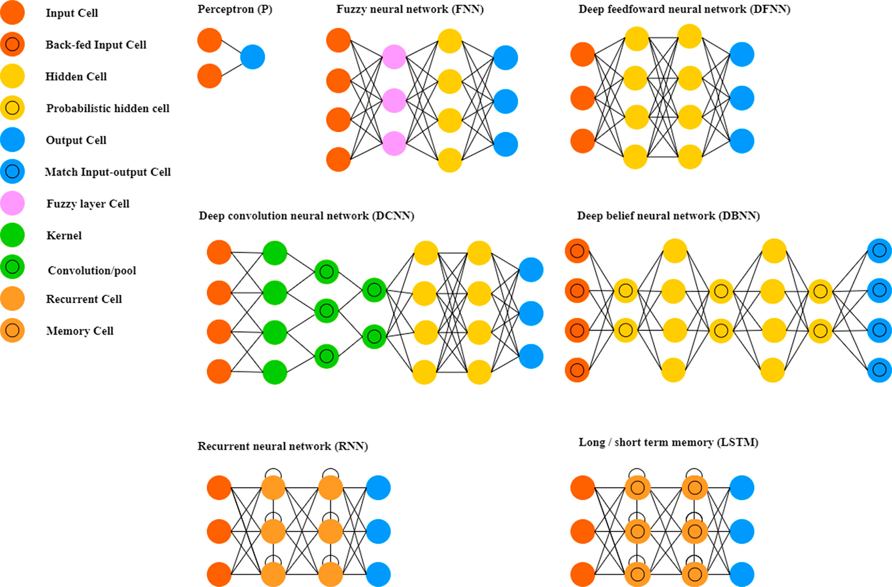
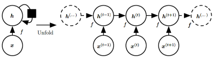
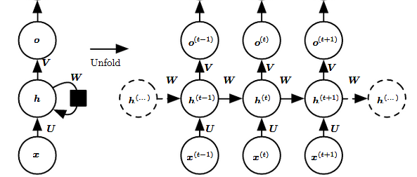

# Neural Networks

Readings:

-   [@james2013, Ch 10] with [(statlearning.com)](https://www.statlearning.com/) and [online course](https://www.dataschool.io/15-hours-of-expert-machine-learning-videos/)

-   [@hastie2001a, Ch 11]

-   [Deep Learning](https://www.deeplearningbook.org/) [@Goodfellow-et-al-2016]

-   Deep Learning with R [@alma991043601650103276]

-   @abdar2021

-   @samek2021a

<br>



[@jiao2020, p. 321]

<br>

Notes:

-   The basic idea behind neural networks (NN) is to find nonlinear functions of linear combinations of inputs to model a response.

-   NN include a large class of models. Even the simple version of these models is a form of "universal approximator" (i.e., can represent any function)

-   NN is a multi-stage regression or classification model that can be represented by a network diagram

    -   In the artificial intelligence community, they want to come up with models that mimic the way neurons and synapses create intelligence in the human brain

<br>

Refresher on Non-linear regression

A model with the form of

$$
Y_i = f(\mathbf{x}_i ; \mathbf{\theta}) + \eta_i, i = 1, \dots, n
$$

where

-   $f(\mathbf{x}_i , \mathbf{\theta})$ is a nonlinear function (known up to parameters, $\mathbf{\theta}$) relating to $E(Y_i)$ to the independent variables $\mathbf{x}_i$

-   $\mathbf{x}_i$ is a $p \times 1$ vector of independent variables (fixed)

-   $\mathbf{\theta}$ is a $q \times 1$ vector of parameters

-   $\eta_i$'s are iid variables mean 0 and variance $\sigma^2$

The objective function that we week to minimize is a loss function

Ex: for continuous data, we can use squared-error loss (e.g., residual sums of squares)

$$
Q(f(\mathbf{x});y; \mathbf{\theta}) = \sum_{i=1}^n \{ y_i - f(\mathbf{x}_i; \mathbf{\theta})\}^2
$$

and

$$
\hat{\mathbf{\theta}} = \underset{\mathbf{\theta}}{\operatorname{argmin}} ( Q(f(\mathbf{x}); y; \mathbf{\theta})
$$

Estimation

To minimize numerically based on a Taylor expansion and iterative algorithm of the form

$$
\hat{\mathbf{\theta}}^{(j + 1)} = \hat{\mathbf{\theta}}^{(j)} - \epsilon_j \mathbf{A}_j \frac{\partial Q (\hat{\theta}^{(j)})}{\partial \mathbf{\theta}}
$$

where

-   $\mathbf{A}_j$ = some positive definite matrix

-   $\frac{\partial Q (\hat{\theta}^{(j)})}{\partial \mathbf{\theta}}$ (i.e., $\nabla_\theta Q(\hat{\mathbf{\theta}}^{(j)})$ ) is the gradient of the objective function $Q(\mathbf{\theta})$ at $\hat{\theta}$

-   $\epsilon_j$ = learning rate

<br>

Estimation via Optimization (this matrix controls the gradient - control all parameters at the same time and stop the model from over shooting, but it is very expensive to calculate; hence, it modern machine learning we usually just control for the learning rate)

-   Gradient Descent: $\mathbf{A}_j \equiv \mathbf{I}_p$

-   Gauss-Newton: $\mathbf{A}_j \equiv [\mathbf{F}( \hat{\theta}^{(j)})' \mathbf{F}( \hat{\theta}^{(j)})]^{-1}$ where $\mathbf{F} (\theta) \equiv \frac{\partial f(\mathbf{x}_i; \mathbf{\theta})}{\partial \theta_j}$ ($n \times p$ Jacobian matrix)

-   Levenberg-Marquardt: $\mathbf{A}_j \equiv [\mathbf{F}( \hat{\theta}^{(j)})' \mathbf{F}( \hat{\theta}^{(j)}) + \tau \mathbf{I}]^{-1}$ (Ridge penalty: $L_2$ regularization)

-   Newton-Raphson: $\mathbf{A}_j \equiv [\frac{\partial^2 Q (\hat{\mathbf{\theta}}^{(j)})}{\partial \theta \partial \mathbf{\theta}'}]^{-1}$ ($p \times p$ Hessian matrix)

<br>

In general, optimization algorithms use an objective function (e.g., loss function) that consists of a sum over the training data

In "big data" problems (large n) and **computation of gradient** can can be taxing (i.e., a large number of floating point operations that must be used for gradient calculation). Plus, we can also have problem with **redundant data** in the training sample.

<br>

## Stochastic Gradient Descent

-   It's an optimization technique denoted as SGD

-   SGD can fix the "big data' problem by considering minimizing the expected loss, which requires estimates of the expected loss.

    -   This can be done with averages of small samples (min-batches) of the training data (assuming the input $\mathbf{x}_i$ come from the same underlying distribution)

-   Considering the expectation of the gradient by randomly sampling a small number of samples from the training set (without replacement) and taking the average turns out to be a very effective solution to this problem. Thus, the method, stochastic gradient descent is "stochastic" because it is based on samples and expectation, but it can also be used in an *online scenario* where data are received **sequentially**.

-   Smaller batch sizes offer more regularization and more flexibility (generalization) outside the training sample

<br>

Basic Stochastic Gradient Descent (SGD) Algorithm (Goodfellow et al. 2016, Ch 18)

-   **Require**: Learning rate $\epsilon$

-   **Require**: Initial parameters $\mathbf{\theta}^{(j)}$

    -   **while** Stopping criterion not met **do**

        -   Sample a mini-batch of $m$ inputs $\{ \mathbf{x}_1, \dots, \mathbf{x}_m \}$ and targets $\{ \mathbf{y}_1, \dots, \mathbf{y}_m \}$

        -   Set $\mathbf{g} = 0$

        -   **for** $i = 1$ to $m$ **do**

            -   Compute gradient estimate: $\mathbf{g} \leftarrow \mathbf{g} + \frac{1}{m} \nabla_\theta Q(f(\mathbf{x}_i; \theta), \mathbf{y}_i)$

        -   **end for**

        -   Apply update: $\mathbf{\theta}^{(j +1)} \leftarrow \mathbf{\theta}^{(j)} - \epsilon \mathbf{g}$

    -   **end while**

Note: one cycle of several min-batches that correspond to all training observations is called an epoch. Hence, the number of epochs is the number of complete passes through the training data.

Using previous update (direction nd magnitude) to make the new update a convex combination of the previous update and the current gradient, it gives a more stable update, which is known as momentum

<br>

Basic Stochastic Gradient Descent (SGD) with Momentum Algorithm (Goodfellow et al. 2016, Ch 8)

-   **Require**: Learning rate $\epsilon$, momentum parameter $\nu$

-   **Require**: Initial parameters $\mathbf{\theta}^{(j)}$ and "velocity" $\mathbf{v}$

    -   **while** Stopping criterion not met **do**

        -   Sample a mini-batch of $m$ inputs $\{ \mathbf{x}_1, \dots, \mathbf{x}_m \}$ and targets $\{ \mathbf{y}_1, \dots, \mathbf{y}_m \}$

        -   Set $\mathbf{g} = 0$

        -   **for** $i = 1$ to $m$ **do**

            -   Compute gradient estimate: $\mathbf{g} \leftarrow \mathbf{g} + \frac{1}{m} \nabla_\theta Q(f(\mathbf{x}_i; \theta), \mathbf{y}_i)$

        -   **end for**

        -   Compute velocity update: $\mathbf{v} \leftarrow \nu \mathbf{v} - \epsilon \mathbf{g}$

        -   Apply update: $\mathbf{\theta}^{(j +1)} \leftarrow \mathbf{\theta}^{(j)} - \mathbf{v}$

    -   **end while**

<br>

The learning rate parameter is the most important tuning parameter in SGD.

Ways to adapt the learning rate (e.g., Goodfellow et al. 2016, Chp. 8):

-   AdaGrad: adapts the learning rates for each parameter by scaling them inversely proportional to the sum of all historical squared

-   RMSProp: modifies AdaGrad by changing the squared gradient accumulation into an exponentially weighted moving average of squared gradients (2nd moments)

-   Adam: combination of RMSProp and momentum that updates both first and second-order moments with exponential weighting and performs a bias correction.

<br>

Challenges and modifications (Gradient Descent Algorithms):

-   Convergence (failure to converge: convergence to local minima)

-   Starting values

-   Regularization if there are many parameters (shrink $\hat{\theta}$ towards 0)

    -   $L_2$ penalty ([Ridge regression]): add $\lambda \sum_{j=1}^q \theta_i^2$ to the objective function, $Q(\theta)$

    -   $L_1$ penalty ([Lasso regression]): add $\lambda \sum_{j=1}^q |\theta_i|$ to objective function, $Q(\theta)$

    -   Others

<br>

-   Recall a neural network is a mutli-stage nonlinear regression or classification model that can be represented by a network diagram

-   Essentially, we get parameter estimates like we would with nonlinear regression (there are just a LOT more to estimate and we call them "weights"). But in this case, we can make it more efficient

<br>

## Simple Single Layer Neural Network

-   A simple type of neural network is a "single hidden layer feed forward network (FNN)" or "single layer perceptron."

    -   Input $\mathbf{x}$ (p-dimensional)

    -   Output $\mathbf{y}$ (k-dimensional) (typically, $k = 1$ in most nonlinear regression and binary classification)

### Hidden Layer

$$
z_j = g( \alpha_{j0} + \sum_{i = 1}^p \alpha_{ji} x_i), j = 1, \dots, J
$$

where

-   $z_j$ is the hidden variable

-   $\alpha_{j0}$ is the "bias" (offset) parameter

-   $\{\alpha_{ji}\}$ are the "weight parameters

-   $g(.)$ is the activation function

A classic activation function is the **sigmoid** (logistic) function:

$$
g(a) = \frac{1}{1 + \exp(-a)}
$$

Other options include:

-   Hyperbolic tangent

-   Radial basis function

-   Rectified linear unit (universal use nowadays)

-   Softmax

-   Identity

Note:

-   The hidden layer is just transformations of the input variables - similar to [Basis Function Representations]

-   These transformations are crucial since the format is very flexible and we "learn" the most useful ones

It simplifies notation to assume $x_0 = 1$ then

$$
z_j = g(\sum_{i=1}^p \alpha_{ji}x_i), j = 1, \dots, J
$$

Typical activation functions include

-   Sigmoid (logistic)

$$
\sigma(z) = \frac{1}{1 + \exp(-z)}
$$

-   Hyberbolic Tangent

$$
\tanh (z) = \frac{ \exp(z) - \exp(-z)}{ \exp(z) + \exp(-z)}
$$

-   Rectified Linear Unit (universal use nowadays because it enforces sparse activations and yields a simple gradient (e.g., it can be computed and stored more efficiently), the offset parameter in $z$ can shift in the inflection point away from zero)

$$
ReLU(z) = \max(0,z)
$$

### Output Layer

$$
y_k = h(\beta_{k0} + \sum_{j=1}^J \beta_{kj} z_j) , k = 1, \dots, K
$$

where

-   $y_k$ is the output variable

-   $h(.)$ is another activation function (typically, the identity function for nonlinear regression or a sigmoid or softmax function for classification problems)

As with the [Hidden Layer], we can write

$$
y_k = h(\sum_{j=0}^J \beta_{kj} z_j), k = 1, \dots, K
$$

In summary, the single layer feed-forward NN can be written as (combining [Hidden Layer] and [Output Layer]):

$$
y_k(\mathbf{x}; \mathbf{\beta}, \mathbf{\alpha}) = h(\sum_{j=0}^J \beta_{kj} g(\sum_{i=0}^p \alpha_{ji} x_i))
$$

Similar to traditional nonlinear regression, to estimate the parameters ("train the network") we select an objective function $Q(\alpha, \beta)$ (e.g., squared error, cross-entropy) and then seek a gradient-based approach to obtain parameter estimates of the $\alpha, \beta$

Hence, NN is just a complicated nonlinear transformation of the inputs

<br>

### Discrimination Problem

#### Two Class Discrimination

When the output has $(0,1)$, the standard neural net implementation includes one hidden layer and ont output unit with a sigmoidal transformation, $h(.)$:

$$
y_l = h(\beta_0 + \sum_{j = 1}^J \beta_j z_{jl}) = h(\sum_{j=0}^J \beta_j z_{jl})
$$

The hidden layer is the same, but the objective function can be changed to **cross-entropy loss** (the negative binomial log-likelihood), where $\tilde{y}$ is the observed response:

$$
Q(\mathbf{\alpha}, \mathbf{\beta}, \{ \mathbf{x}_l , \tilde{y}_l \}) = - \sum_l \tilde{y}_l + ( 1 - \tilde{y}_l) \log(1 - y_l)
$$

#### Multiclass Discrimination

When $K > 2$ category classification, one has $K$ output functions:

$$
o_{kl} = \sum_{j = 0}^{J} \beta_{kj} z_{jl}, k = 1, \dots, K
$$

softmax function is used to transform these to the classification output (the same transformation in multinomial logistic regression);

$$
y_{kl} = h(o_{kl}) = \frac{ \exp(o_{kl})}{\sum_{k'} \exp( o_{k'l})}
$$

The objective function is given by cross-entropy (negative multinomial log-likelihood):

$$
Q(.) = - \sum_l \sum_k \tilde{y}_{kl} \log(y_{kl})
$$

Example by [@james2013 Ch. 10]

```{r}
library(ISLR2)
Gitters <- na.omit(Hitters)
n <-nrow(Gitters)
set.seed(13)
ntest <- trunc(n/3)
testid <- sample(1:n, ntest)

```

Get prediction error of the linear model

```{r}
lfit <- lm(Salary ~ ., data = Gitters[-testid,])
lpred <- predict(lfit, Gitters[testid,])
with(Gitters[testid,],mean(abs(lpred - Salary)))

```

```{r}
x <- scale(model.matrix(Salary ~ . -1, data = Gitters)) 
y <- Gitters$Salary

```

```{r}
library(glmnet)
cvfit <- cv.glmnet(x[-testid,], y[-testid],type.measure = "mae")
cpred <- predict(cvfit, x[testid,], s = "lambda.min")
mean(abs(y[testid] - cpred))
```

```{r}
# library(keras)
# modnn <- keras_model_sequential() %>% 
#     layer_dense(units = 50, activation = "relu", input_shape = nocl(x)) %>% 
#     layer_dropout(rate = 0.4) %>% 
#     layer_dense(units = 1)
```

<br>

## Deep Neural Networks

### Backpropagation

-   used in the [Stochastic Gradient Descent] to train the parameters

-   It applies the chain rule to calculate the gradient (thank to the hierarchical/compositional nature of the model)

$$
\frac{\partial Q}{\partial \alpha_{ji}} = \frac{\partial Q}{\partial y_k} \frac{\partial y_k}{\partial z_j} \frac{\partial z_j}{\partial \alpha_{ji}} , j = 1, \dots, J; i = 0, \dots, p
$$

$$
\frac{\partial Q}{\partial \beta_{kj}} = \frac{\partial Q}{\partial y_k} \frac{\partial y_k}{\partial \beta_{kj}} , k = 1, \dots, K; j = 0, \dots, J
$$

<br>

Example:

Nonlinear regression with a single output

-   $h(.)$ the identity function

-   $g(.)$ the sigmoid function

-   squared error loss

Let $\{ \tilde{y}_{(l)}, \mathbf{x}_{(l)} \}$ correspond to the observed input/output pair for the $l$-th sample (in the minbatch)

```{=tex}
\begin{equation}
(\#eq:1)
y_{(l)} = \sum_{j=1}^J \beta_j z_{j(l)}
\end{equation}
```
```{=tex}
\begin{equation}
(\#eq:2)
z_{j(l)} = g(\sum_{i=0}^p \alpha_{ji} x_{i(l)})
\end{equation}
```
Squared-error objective function

$$
Q(\alpha, \beta, \{ \mathbf{x}, \mathbf{\tilde{y}}) \}) = \frac{1}{2} \sum_l (\tilde{y}_{(l)} - y_{(l)})^2
$$

Then, the gradients are

```{=tex}
\begin{equation}
(\#eq:3)
\frac{\partial Q}{\partial \beta_{kj}} = \frac{\partial Q}{\partial y_k} \frac{\partial y_k}{\partial \beta_{kj}} = - \sum_l (\tilde{y}_{(l)} - y_{(l)}) z_{j(l)}
\end{equation}
```
```{=tex}
\begin{equation}
(\#eq:4)
\begin{aligned}
\frac{\partial Q}{\partial \alpha} &= \sum_l \frac{\partial Q}{\partial y_k} \frac{\partial y_k}{\partial z_j} \frac{\partial z_j}{\partial \alpha_{ji}} \\
&= \sum_l \{- (\tilde{y}_{(l)} - y_{(l)}) \} \{\beta_j\} \{ z_{j(l)} (1 - z_{j(l)}) x_{i(l)} \}
\end{aligned}
\end{equation}
```
The $(\tilde{y}_{(l)} - y_{(l)})$ term in the equations \@ref(eq:3) and \@ref(eq:4) are residuals.

The other terms indicate what fraction of the residual gets associated with the parameters in the hidden and output layers

Note: $\partial g(ab) / \partial a = g(a) (1 - g(a))b$ when $g(.)$ is a sigmoid function

Then, basic SGD algorithm updates parameters

```{=tex}
\begin{equation}
(\#eq:5)
\beta_{j}^{(r+1)} = \beta_j^{(r)} - \epsilon^{(r)} \frac{1}{L} \sum_l \frac{\partial Q}{\partial \beta_j}
\end{equation}
```
```{=tex}
\begin{equation}
(\#eq:6)
\alpha_{ji}^{(r+1)} = \alpha_{ji}^{(r)} - \epsilon^{(r)} \frac{1}{L} \sum_l \frac{\partial Q}{\partial \alpha_{ji}}
\end{equation}
```
where

-   $\epsilon^{(r)}$ is the learning rate parameter

-   $L$ is the number of samples in the summation

Updates are done in a two-pass algorithm (forward and backward - hence the name backpropagation)

-   In the forward pass, the current parameter values are fixed at the r-th values and $z_{j(l)}$ and $y_{(l)}$ are calculated using \@ref(eq:1) and \@ref(eq:2)

-   In the backward pass, the gradients are then calcualted from \@ref(eq:3) and \@ref(eq:4) using the r-th updates; then, the parameters are updated using \@ref(eq:5) and \@ref(eq:6)

<br>

Notes:

-   Under backpropagation algorithms, each hidden unit passes and receives info only to and from units that share a connection (i.e., "local" algorithm)

    -   which facilitates computation in a parallel computing environment, which is beneficial to process large datasets (this is why deep learning took off).

-   We can also add multiple outputs, $y_{k(l)}, k = 1, \dots, K$

-   Surprisingly, the chain rule gives the same general form for the backpropagation gradient terms for cross-entropy loss (both 2-class and multi-class cases) as for squared error loss.

-   In real real, we never calculate derivatives by-hand because now we have automatic differentiation that can symbolically/algorithmically get the derivatives

<br>

### Deep Feedforward Networks

-   also known as Multilayer Perceptrons

-   Problems like acoustic processing, image processing, and natural language processing, have complex structure that requires the use of "deep learning" algorithms

-   These are neural networks with **many hidden layers**, with outputs from one layer becoming the input of the next.

-   The number of units in each layer is called **width**

-   The number of layers is the **depth** of the network

-   The usual challenge with deep models is that they can be severely over-parameterized, unless we use regularization.

Example of 2-Layer

Model characteristics:

-   Two hidden layers

-   One output layer for nonlinear regression

$$
z_{1j(l)} = g(\sum_{i=0}^p \alpha_{1ji} x_{i(l)}), j = 1, \dots, J_1
$$

$$
z_{2j'(l)} = g(\sum_{j=1}^{J_1} \alpha_{2j'j}z_{1j(l)}), j' = 1, \dots, J_2
$$

$$
y_{(l)} = \sum_{j'=0}^{J_2} \beta_{j'} z_{2j'(l)}
$$

Similar to [Backpropagation], as the depth increases the more number of parameters you have to estimate (this is the problem)

It helps to have multiple hidden layers in a deep learning model because the chain of transformations allow the network to learn complex transformation of the input

For example, when applied to images (e..g, in a convolutional neural network), different scales in images are identified at different levels).

<br>

### Implementation

-   Preprocessing of the Data: Two choices:

    -   Feature normalization per sample: it can help to center each input $\mathbf{x}_m$ (demean)

    -   Global feature standardization (more commonly used): subtract the average form all the elements of each feature element across the entire training set, and divides by the associated standard deviation (we also have to apply this to the test set, but using the means and standard deviation from the training set).

-   Model Initialization

    -   Because neural models are highly nonlinear, they can be very sensitive to the initial parameter values. But we can follow the following general heuristic "principles":

        -   Choose parameters such that each hidden variable is operating tin the linear range of its activation functions. Because this depends on weights and the inputs, that's why we standardize the inputs

        -   Choose parameters randomly (since hidden units are interchangeable, we need them to find different features, so it's important that they don't have the same weights)

    -   Exemptions: **pretraining**

-   Regularization

    -   Because neural networks tend to overfit, we have to use regularization

    -   **Weight Decay** (commonly used): which is $L_2$ ([ridge][Ridge regression]) penalty applied to the objective function of the form (e.g., $\lambda(\sum_{ji} \alpha_{ji}^2 + \sum_{kj} \beta_{kj}^2)$ where $\lambda \ge 0$ is the tuning parameter. It will add terms $2 \lambda \beta_{kj}$ and $2 \lambda \alpha_{ji}$ to the gradient expressions

    -   **Weight Elimination**: is the same thing as $L_1$ ([Lasso][Lasso regression]) penalties, in which small parameters are set to 0.

    -   **Dropout**: randomly omit a certain (relatively small) percentage (say, $\gamma$) of the hidden units in each hidden layer for each minbatch of samples during the backpropagation training. This can help break up the dependence in the hidden units, and prevents overfitting (improving generalization). To implement, set the activation to 0 (no information propagates through that unit). Then, we re-weight those units that remain in the model to account for those that were removed. Dropout can estimate uncertainty for model predictions).

    -   **Early Stopping** (simplest): rarely does the best generalization of a deep model occur at the local minimum obtained by the gradient descent algorithm. People come up with early stopping, which means stopping the gradient descent algorithm before it has "converged." The choice of the iteration to stop is a hyperparameter that must be chosen via a validations et or by trail and error. It can be used with other forms of regularization

    -   **Weight Sharing**: In some deep model, it makes sense that weights are similar (e..g, imagine weights connected to components of an image or a group of words). Then, we can force these weights to be identical, or add a penalty term that favors them being similar (benefit is that we can estimate less parameters).

    -   **Data Augmentation**: since deep models requires a lot of data to train, when there are too few samples, it's hard for the model to generalize to new data. For models like CNNs, we can use data augmentation to generate more training data (from existing training samples by transforming inputs to produce new input samples that are similar, but different to the training data). We can't do it in inference problem, but since we are doing prediction problem, this method is fine.

    -   **Pretraining**: we use a pretrained network as starting values in backpropagation algorithm (or in cases that you have a huge sample has been used to train a network, just use the pretrained model directly). We typically use this method in image classification because many architectures have been trained on ImageNet already (about 1k categories, and 1.4 mil images). In the early days of deep models, other form of unsupervised generative pre training were used (e..g, layered restricted Boltzmann machines, autoencoders).

-   Batch Size Selection:

    -   Minibatches in stochastic gradient descent is advantageous computationally. In deep learning training samples are divided by the **batch size** and then we cycle through all training data. Each iteration over the training data is called an **epoch**. At the beginning of the optimization, it's preferable to have large gradient variance so the solution can jump out of local minima, which suggests that the minibatch sample should be smaller initially. Then, we adjust it to have larger minibatches in alter stages of the optimization (when we don't want to ump around as much). Thus, we can vary minibatch size through the iterations.

-   Metrics: to monitor the progress of the training (i.e., at the end of each epoch, we evaluate model performance). Examples

    -   An estimate of the loss from the training and validation data

    -   Classification accuracy (error rate)

-   Momentum: we usually include a "momentum" term in the [Stochastic Gradient Descent] algorithm to take into account the previous gradients (i.e., we take a convex combination of the previous gradient and the current gradient estimates). The momentum value is typically chosen between $0.9 \to 0.99$

-   Learning Rate: the actual learning rate is a function of both the "learning rate parameter" ($\epsilon$) and the minibatch size $M_b$. Hence, we adjust the ratio $\epsilon^* = \epsilon / M_b$ to find a good learning rate. In cases that you vary minibatch size, the learning rate is changed as well.

-   Network Architecture: The number of layers and the number of hidden units at each layer are parameters as well. We need enough hidden units to capture features (these are really just feature extraction models), and we don't want "too many" (i.e., overfitting). Hence, this is where the "art" comes into deep models. In general, wide/shallow models are easier to overfit and narrow/deep models are easier to underfit. It's recommended that the lower levels have more hidden units.

## Convolutional Neural Networks {#convolutional-neural-networks}

-   A success story of multi-level neural networks

-   The patterns they learn are translation invariant and they also learn spatial hierarchies of patterns (i.e., whereas densely connected network learn global patterns in their input space, convolution layers learn local patterns.

### Convolution

$$
(f \times g) (t) = \int_{R^d} f(\tau) g(t - \tau) d \tau = \int_{R^d} f(t - \tau) g(\tau) d\tau
$$

Discrete convolution (e.g., $d = 2$)

$$
f[x, y ] \times g [x, y] = \sum_{i = - \infty}^\infty \sum_{j = - \infty}^\infty f[i,j] g[x-i, y - j]
$$

where $f[]$ is a "kernel" weight function that is applied to elements of the spatial image $g[]$ (similar to [Kernel Smoothing])

The difference is that [Kernel Smoothing] integrates to 1 (or sum to 1 with discrete data), while [Convolution] we don't have to satisfy this constraint. Hence, sometimes people can refer to $f[]$ as "kernels" or "filters"

**Notes**:

-   Due to the edge effect (less data on edges), the convolved output is smaller. Hence, we can mitigate it by **padding** the original input space with 0 around edges (so that the convolution can be centered on every pixel value, thus giving a convolved feature map that is the same size as the original image).

-   Ideally, we learn these kernels (filters) instead of specifying them (even though we have some standard specifications). Each of these filters convolved with the input space produces a new **feature map**. Typically, they are $3 \times 3$ or $5 \times 5$

-   CNN reduces the parameter space by assuming there is **only one set of weights for each convolution**

    -   Since weights are shared, we can benefit from dimension reduction in the parameter space

    -   After learning the weights, we will use "pooling layer" (or "subsamplng" or "down sampling").

-   **Tensors**: In practice, input (images) are often tensors. Hence, there is **a multivariate value** at each spatial location (pixel).

    -   Example: in color images in RGB format, there are three values that define the pixel color. Then, CNNs consider a tensor convolution where the kernel averaging is over **location and the variables** (or, "channels" such as red, green, blue color value). Each layer of a CNN has "height, width, and depth" (i.e., 3-d). For black and white images, each pixel has one value, so the "depth" is 1.

-   Hidden layers in the CNN will always have depth \>1 (in practice, this depth is way larger). The filter operates on a relatively small part of the image (in x and y), but across the entire depth; so the weights (in 3-d) form a tensor.

-   **Stride**: When we skip pixels in convolution, it's called strides (less weights to understand and computation)

-   Bach normalization: Since there are multiple filters for each layer, it is beneficial to normalize the convolved pixels across these multiple filters (for a given layer), or a subset of those filters, which should be applied immediately after the ReLU step. This can also help with gradient propagation and allow for deeper networks in general

-   Data Augmentation: augmenting the samples by a number of random transformations that yield believable images

-   Pretrained networks: using a saved network that was previously trained on a large dataset (e.g., ImageNet): the spatial hierarchy of features learned by the pretrained network can effectively act as a generic model of the visual world. To implement, you can either use it as

    -   feature extraction: use the convolution base layer (which is "frozen") from the pre-trained model, and only train the flattened fully connected last layer(s)

    -   fine-tuning: unfreezing the few top layers of the pre-trained model and jointly training both the newly added part of the model (the last fully connected layer) and the top layers. However, you can only fine-tune the top layers after the top level is already trained.

Convolution calculation

-   very expensive

-   Traditional approach used the fast Fourier transform (FFT)

Let $F(f), F(g)$ be the Fourier transforms of f and g. Then

$$
F(f \times g) = F(f)\cdot F(g) \\
f \times g = F^{-1}(F(g) \cdot F(g))
$$

Thus, we do element-wise multiplication in Fourier space, which is way faster.

### Pooling

-   The pooling layer considers a small rectangular block from the convolutional step and subsamples it to produce a single output.

-   Ways to do pooling

    -   Block maximum ("max pooling") (favored): usually done with $2 \times 2$ windows and a stride of 2

    -   BLock average (mean)

    -   BLock weighted average

    -   Downsampling (systemically subsampling one element per block)

-   Pooling helps **make the network invariant to translations of the input**, especially when structure is more important than location

-   **Rectification**: Convolved images typically go through a ReLU rectification ($ReLU(x) = max(0,x)$) before pooling

### Structure and training

-   Convolution step and the activations for the flattened layers requires training , while activation and pooling layers are typically specified (don't learn)

-   The parameters for the convolutions for any given filter are the same for the entire feature map, which allows the presence of a shape in any part of the feature map to be processed the same way, regardless of its special location (i.e., translation invariant)

-   Different from the convolution operator, the pooling operator applies to each feature map separately (i.e., don't pool across the depth dimension).

-   Each feature in the final spatial layer is connected to each hidden state in the first fully connected layer, which works like the layers in the deep FNN. There can be multiple fully connected layers (but remember it can be expensive). Most of the parameters int the CNN correspond to these layers.

-   In practice, the backpropagation algorithm can be implemented using matrix and vector multiplications.

### Interpretation

-   To visualize what CNNs learn (e.g., explainable AI), we can visualize

    -   intermediate outputs (activations)

    -   the intermediate filters

    -   "heatmaps" of class activation on an image (related to "layer-wise relevance propagation", which operates by propagating the prediction backward in the neural network, using a set of purposely designed propagation rules),

<br>

## Recurrent Neural Networks

-   Traditional neural networks ([CNNs](#convolutional-neural-networks)) don't account for the sequential dependence of inputs and outputs, such as

    -   document and time series classification

    -   time series comparisons

    -   sequence-to-sequence learning (translation)

    -   sentiment analysis in text

    -   time series forecasting

-   Statisticians considered sequential dependence long before in time-series and spatio-temporal modeling, but these model can still be limited when it comes to complex nonlinear or non-Markovian dependence

-   RNNs were developed to handle feedback models for sequence data. Now, they become a successful deep learning method, particularly for language processing applications.

-   RNNs are closely related to multivariate state-space models for dynamical systems (e.g., time series, econometric, or spatio-temporal statistics).

Consider a classical dynamical system

$$
\mathbf{s}_t = f(\mathbf{s}_{t-1} ; \mathbf{\theta})
$$

where

-   $\mathbf{s}_t$ represents the state of the system at time $t$

-   This is called "recurrent" because the state at the time t is a function of the state at time $t-1$

In "unfolded" form

$$
\begin{aligned}
\mathbf{s}_t &= f(\mathbf{s}_{t-1}; \mathbf{\theta}) \\
&= f(f(\mathbf{s}_{t-2}; \mathbf{\theta}); \mathbf{\theta}) \\
&= f(f(f(\mathbf{s}_{t-3}; \mathbf{\theta}); \mathbf{\theta}); \mathbf{\theta}) \\
&= \dots
\end{aligned}
$$

Where parameters $\mathbf{\theta}$ are shared across all states

Similar to traditional state space model, the states are considered "hidden" (denoted as $\mathbf{h}_t$) and add external inputs $\mathbf{x}_t$

$$
\mathbf{h}_t = f(\mathbf{h}_{t-1}, \mathbf{x}_t; \mathbf{\theta})
$$

Hence, sequences are processed by iterating through the sequence elements and maintaining a state (containing info relative to what it has seen so far via an internal feedback loop)



(picture by @Goodfellow-et-al-2016 Ch. 10)

Incorporating RNN with output



(picture by @Goodfellow-et-al-2016 Ch. 10)

A basic RNN setup is

$$
\mathbf{y}_t = g_o (\mathbf{o}_t) \\
\mathbf{o}_t = \mathbf{W}_{hy} \mathbf{h}_t \\
\mathbf{h}_t = g_h (\mathbf{W}_{hh} \mathbf{h}_{t-1} + \mathbf{W}_{xh} \mathbf{x}_t)
$$

where

-   $g_o(.), g_h(.)$ are activation functions

-   $\mathbf{W}_{hy}, \mathbf{W}_{hh}, \mathbf{W}_{xh}$ are weight matrices (typically contain bias terms as well).

To estimate these parameters, we still define loss function and optimize by backpropagation. However, with common parameters across time, they introduce some complications. To solve this,

-   Traditionally, the **backpropagation through time** (BPTT) algorithm via stochastic gradient descent can handle. But it introduces the problem of **vanishing gradient/exploding gradient**: when the gradients get propagated over many times they tend to either (1) vanish (most of the time) or (2) explode

    -   Even though there are ways to mitigate exploding gradient (to ensure stability), the series of dependencies through time can still lead to exponentially smaller weights

-   Or we add "gates" that selectively allow info from the past to influence the present. These gates serve to save info for later, breaking the gradient

### Long Short-Term Memory (LSTM) RNNs {#long-short-term-memory-lstm-rnns}

-   This is the most common gated RNN.

-   It creates time paths that have gradients that don't vanish or explode

Setup

+------------------------+----------------------------------------------------------------------------------+
| Name                   | Formula                                                                          |
+========================+==================================================================================+
| Output                 | $\mathbf{y}_t = g_o(\mathbf{Vh}_t)$                                              |
+------------------------+----------------------------------------------------------------------------------+
| Hidden State           | $\mathbf{h}_t = \tanh (\mathbf{c}_t) \odot \mathbf{o}$                           |
+------------------------+----------------------------------------------------------------------------------+
| Internal Memory        | $\mathbf{c} = \mathbf{c}_{t-1} \odot \mathbf{f} + \mathbf{g} \odot \mathbf{i}$   |
|                        |                                                                                  |
|                        | (first part = forgetting, second part =new info)                                 |
+------------------------+----------------------------------------------------------------------------------+
| Candidate Hidden State | $\mathbf{g} = \tanh (\mathbf{U}^g \mathbf{x}_t + \mathbf{W}^g \mathbf{h}_{t-1})$ |
+------------------------+----------------------------------------------------------------------------------+
| Output Gate            | $\mathbf{o} = g(\mathbf{U}^o \mathbf{x}_t + \mathbf{W}^o \mathbf{h}_{t-1})$      |
+------------------------+----------------------------------------------------------------------------------+
| Forget Gate            | $\mathbf{f} = g(\mathbf{U}^f \mathbf{x}_t + \mathbf{W}^f \mathbf{h}_{t-1})$      |
+------------------------+----------------------------------------------------------------------------------+
| Input Gate             | $\mathbf{i} = g(\mathbf{U}^i \mathbf{x}_t + \mathbf{W}^i \mathbf{h}_{t-1})$      |
+------------------------+----------------------------------------------------------------------------------+

where $g(.)$ is typically a sigmoid function and $\bigodot$ is Hadamard product (component-wise multiplication for matrices).

-   The input gate selects hidden units that get input to time $t$

-   The forget gate selects the hidden states at the previous time to reset to 0 at time $t$

-   The output gate selects the states that will be related to the response

-   The memory units indicate when to remember or forget previous hidden states, which will mitigate the vanishing/exploding gradient problem. And its assumption is also plausible because many processes that events in the distant past can influence presence irrespective of the intervening states.

Application:

-   Classification /Segmentation

-   Object Detection/Localization

-   Similarity learning

-   Generative models

-   Video analysis

### Gated Recurrent Units

| Name                   | Formula                                                                                             |
|------------------------|-----------------------------------------------------------------------------------------------------|
| Output                 | $\mathbf{y}_t = g_o (\mathbf{Vh}_t)$                                                                |
| Hidden state           | $\mathbf{h}_t = (1- \mathbf{z}) \circ\mathbf{s}+\mathbf{z} \odot \mathbf{h}_{t-1}$                  |
| Candidate Hidden State | $\mathbf{s} = \tanh (\mathbf{U}^s \mathbf{x}_t + \mathbf{W}^s (\mathbf{r} \odot \mathbf{h}_{t-1}))$ |
| Reset Gate             | $\mathbf{r} = g(\mathbf{U}^r \mathbf{x}_t+ \mathbf{W}^r \mathbf{h}_{t-1})$                          |
| Update Gate            | $\mathbf{z} = g(\mathbf{U}^z \mathbf{x}_t + \mathbf{W}^z \mathbf{h}_{t-1})$                         |

If $\mathbf{r} = 1, \mathbf{z} = 0$, then it is the vanilla RNN

Notes:

-   [Long Short-Term Memory (LSTM) RNNs](#long-short-term-memory-lstm-rnns) and [Gated Recurrent Units] are computationally intensive to fit, and require parallelized implementation

-   Similar to the standard [Deep Neural Networks] and [Convolutional Neural Networks](#convolutional-neural-networks) require a lot of data

-   RNNs are more "black boxes" given their complexity, which has the benefit of making them modular and connectable, hence much deeper

-   **Recurrent Dropout**: helps with overfitting. But it should not be applied before a recurrent layer as it measures information in the flow. Instead of allowing the dropout pattern to vary randomly with each time step, we use *the same pattern of dropout for every time step within the recurrent layer* (known as **recurrent dropout**). We can still use regular dropout for this input layers

-   **Stacking Recurrent Layers**: Similar to [Deep Neural Networks] and [Convolutional Neural Networks](#convolutional-neural-networks), we can also improve learning and build more powerful RNNs by stacking the recurrent layers, but it can increase dramatically the cost of implementation.

-   **Recurrent Attention**: [Recurrent Neural Networks] can't localize in certain regions of the sequence. Generally, a **neural attention mechanism** equips a neural network with the ability to focus on a subset of its inputs ([more detail](http://akosiorek.github.io/ml/2017/10/14/visual-attention.html)). [Recurrent Attention Unit](https://arxiv.org/abs/1810.12754) was described, which integrates an attention mechanisms into the interior of RNN by adding an attention gate. The attention gate enhances RNN's ability to remember long-term memory and help memory cells quickly discard unimportant content @zhong2020

-   We can also use one-dimensional (1D) [CNNs](#convolutional-neural-networks) for sequence data. This method can be cheaper to implement, but not as good when **global order matters** (e.g., time series where the recent past has more info). However, it's not necessarily true for text data, 1D CNNs can outperform RNNs. People also combine 1D CNN layers and RNN layers (usually the CNN layer is first to reduce dimensionality) [@alma991043601650103276]
