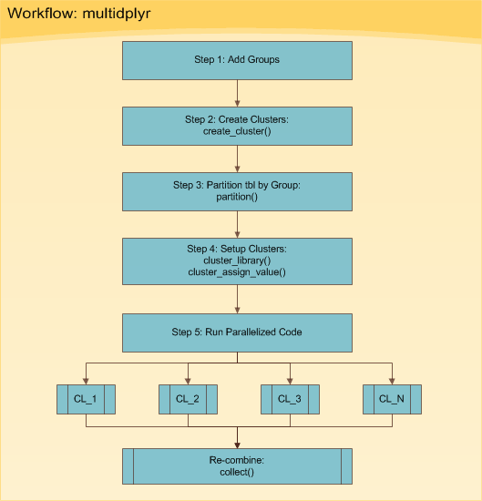

# Parallel Computing

According to [*Matt Jones*](https://nceas.github.io/oss-lessons/parallel-computing-in-r/parallel-computing-in-r.html), computation is bound by

-   CPU (take much CPU time)

-   Memory: take memory

-   I/O: take time to read/write from disk

-   Network: transfer time

Parallel computing can help with CPU-bound

By default, computer programming software (e.g., Python and R) usually use one core processor for serial computation. However, with big data, the iterative process can take a lot of time. If we don't have to data analysis in a sequential step, a in an analysis or can break the big data set into smaller chunks and process them simultaneously, it will increase the speed of the analysis process.

Hence, we have parallel computing that utilizes the philosophy of "divide and conquer." Hence, parallel computing

There are two actors in a parallel backend

1.  Director: who tells workers what to do, and manages computing resources (processors, RAM memory, network bandwidth, etc.)
2.  Workers: who execute what the director told them to do

A parallel backend is the way workers and director communicate

There are 2 types of parallel backends

| Type  | Available                                 | Work in clusters | Col4                                                                                  | Col5 |
|-------|-------------------------------------------|------------------|---------------------------------------------------------------------------------------|------|
| FORK  | Unix machines (Linux, Mac, etc)           | Nope             | Workers share the same environment (data, loaded packages, functions) as the director |      |
| PSOCK | Unix and Windows (default for `forecah` ) | Yep              | environment is copied to the environment of each worker                               |      |

FORK is more efficient because there is only one environment and only outputs are sent back to the director (40% faster than PSOCK)

1.  FORK
2.  PSOCK

## multidplyr

[](https://www.business-science.io/code-tools/2016/12/18/multidplyr.html#figure1)

Typically, there are two situations that we can utilize this process:

1.  A big dataset that needs to be broken up into small ones and perform analysis on each
2.  A data set that needs to perform multiple analyses (e.g., models).

Old example provided by [Business Science](https://www.business-science.io/code-tools/2016/12/18/multidplyr.html#figure1) (no longer available)

Example provided by the package's author

```{r}
library(multidplyr)

cluster <- new_cluster(parallel::detectCores() - 2) # use all cores except 2
cluster_library(cluster, "dplyr") # you have to load your libraries to be used across workers (clusters)
```

First way (more efficient)

read different files on each worker (cluster)

```{r, eval = FALSE}
# Create a filename vector containing different values on each worker
cluster_assign_each(cluster, filename = c("a.csv", "b.csv", "c.csv", "d.csv"))

# Use vroom to quickly load the csvs
cluster_send(cluster, my_data <- vroom::vroom(filename))

# Create a party_df using the my_data variable on each worker
my_data <- party_df(cluster, "my_data")

```

If you put your files separately in a folder already, you can use

```{r, eval = FALSE}
files <- dir(path, full.names = TRUE)
cluster_assign_partition(cluster, files = files)
```

Second way

If you load the dataset already, then you have to `partition` them across workers (clusters).

You can also `group_by` before `partition` if your analysis requires observations to be in the same group

```{r}
library(nycflights13)

flight_dest <- flights %>% group_by(dest) %>% partition(cluster)
flight_dest
```

```{r}
flight_dest %>% 
  summarise(delay = mean(dep_delay, na.rm = TRUE), n = n()) %>% 
  collect()
```

For finished computation across cores, use `collect()` to get the data back to one dataframe or one place

```{r}

rm(cluster)
detach(package:multidplyr)
rm(list = ls())

```

## parallel

Example by [Blas M. Benito](https://www.blasbenito.com/post/02_parallelizing_loops_with_r/)

```{r}
#automatic install of packages if they are not installed already
list.of.packages <- c(
  "foreach",
  "doParallel",
  "ranger",
  "palmerpenguins",
  "tidyverse",
  "kableExtra"
  )
new.packages <- list.of.packages[!(list.of.packages %in% installed.packages()[,"Package"])]

if(length(new.packages) > 0){
  install.packages(new.packages, dep=TRUE)
}

#loading packages
for(package.i in list.of.packages){
  suppressPackageStartupMessages(
    library(
      package.i, 
      character.only = TRUE
      )
    )
}

#loading example data
data("penguins")


```

Set up for local computer

```{r}

n.cores <- parallel::detectCores() - 2 # use all cores except 2

#create the cluster
my.cluster <- parallel::makeCluster(
  n.cores, 
  type = "PSOCK" # alternatively, we can use FORK
  )

#check cluster definition (optional)
print(my.cluster)

#register it to be used by %dopar%
doParallel::registerDoParallel(cl = my.cluster)

#check if it is registered (optional)
foreach::getDoParRegistered()

#how many workers are available? (optional)
foreach::getDoParWorkers()

x <- foreach(
  i = 1:10, 
  .combine = 'c'
) %dopar% {
    sqrt(i)
}

# when done, stop cluster

parallel::stopCluster(cl = my.cluster)
```

Example by [Jens Moll-Elsborg](https://towardsdatascience.com/getting-started-with-parallel-programming-in-r-d5f801d43745)

`parLapply` equivalent to `lapply`

```{r}
# Generate data
data <- 1:1e9
data_list <- list("1" = data,
                  "2" = data,
                  "3" = data,
                  "4" = data)


library(parallel)
cl <- parallel::makeCluster(detectCores() - 2)
parallel::parLapply(cl,
                    data_list,
                    mean)

# Close cluster
parallel::stopCluster(cl)
```

Another example by [Blas Benito](https://www.blasbenito.com/post/02_parallelizing_loops_with_r/) regarding tuning random forest hyperparameters using parallel computing

## doParallel

Iterations in a loop

```{r}
library(doParallel)
library(parallel)
library(foreach)

# Detect the number of available cores and create cluster
cl <- parallel::makeCluster(detectCores() - 2) # use all cores except 2

# Activate cluster for foreach library
doParallel::registerDoParallel(cl)


r <- foreach::foreach(i = 1:length(data_list),
                      .combine = rbind) %dopar% {
                          mean(data_list[[i]])
                      }


# Stop cluster to free up resources
parallel::stopCluster(cl)
```

```{r}
pacman::p_unload(pacman::p_loaded(), character.only = TRUE)
```

```{r}
# detach(package:parallel)
```
