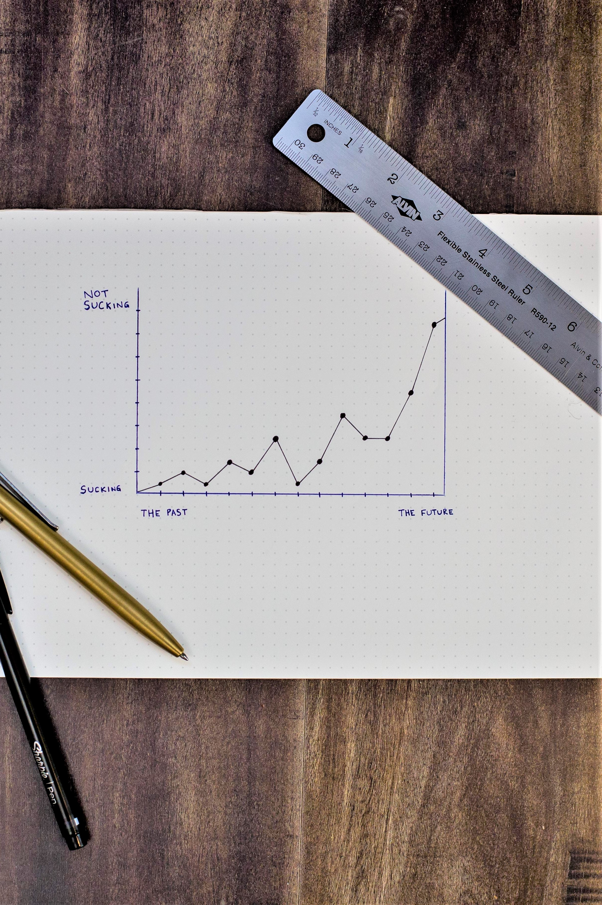

# Preface {.unnumbered}

```{r setup, include = FALSE}
knitr::opts_chunk$set(warning = FALSE,
                      message = FALSE)
```

```{r, include = FALSE}
# automatically create a bib database for R packages
knitr::write_bib(c(.packages(), 'bookdown', 'knitr', 'rmarkdown'),
                 'packages.bib')
```

 This is the second book in the Data Analysis series. Like its companion, it is an effort to simplify and demystify data analysis, making it accessible to a wide audience. Writing it has been as much a learning journey for me as I hope it will be for you.

The first book, [*A Guide on Data Analysis*](https://bookdown.org/mike/data_analysis/), is concerned with interpretation and causal inference: understanding *why*, and estimating effects we can defend. This book turns to the other half of the discipline, prediction. The principles and philosophy are the same; the goal is different.

------------------------------------------------------------------------

This book differs from the [first one](https://bookdown.org/mike/data_analysis/) in emphasis: it is about building models that predict well, whereas the first book is about interpreting relationships and defending causal claims. The opening chapters develop that distinction (prediction versus estimation) in full; the preface only needs to flag it.

------------------------------------------------------------------------

## How to cite this book {.unnumbered}

This is the open online edition. If you reference it, please also consider citing the companion volume, [*Foundations of Data Analysis*](https://bookdown.org/mike/data_analysis/) (Springer Cham, 2025).

1. APA (7th edition)

Nguyen, M. *Advanced data analysis*. Retrieved from [https://bookdown.org/mike/advanced_data_analysis/](https://bookdown.org/mike/advanced_data_analysis/)

2. MLA (8th edition)

Nguyen, Mike. *Advanced Data Analysis*. [https://bookdown.org/mike/advanced_data_analysis/](https://bookdown.org/mike/advanced_data_analysis/).

3. Chicago (17th edition)

Nguyen, Mike. *Advanced Data Analysis*. [https://bookdown.org/mike/advanced_data_analysis/](https://bookdown.org/mike/advanced_data_analysis/).

4. Harvard

Nguyen, M. *Advanced Data Analysis*. Available at: [https://bookdown.org/mike/advanced_data_analysis/](https://bookdown.org/mike/advanced_data_analysis/)

```bibtex
@book{Nguyen_AdvancedDataAnalysis,
  author = {Nguyen, Mike},
  title  = {Advanced Data Analysis},
  url    = {https://bookdown.org/mike/advanced_data_analysis/}
}
```

------------------------------------------------------------------------

## Code Replication {.unnumbered}

This book was built with `r R.version.string` and the following packages:

```{r, echo = FALSE, results="asis", eval = FALSE}
# if you want to make it beautiful for markdown
deps <- desc::desc_get_deps()
pkgs <- sort(deps$package[deps$type == "Imports"])
pkgs <- sessioninfo::package_info(pkgs, dependencies = FALSE)
df <- tibble::tibble(
  package = pkgs$package,
  version = pkgs$ondiskversion,
  source = gsub("@", "\\\\@", pkgs$source)
)
knitr::kable(df, format = "markdown")
```

<br>

```{r, echo = FALSE}
devtools::session_info()
```
